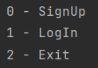
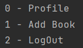
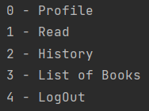
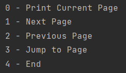

# Online Book Reader

## Brief

Online_Book_Reader is an app simulates reader apps. There is 2 type of users:
Admin, and Customer. For the Admin, s/he is capable of adding books to the system. 
For the Customer, s/he can read the book in the system, and save his/her last 
reading sessions to complete at another time. Project uses csv files to save the data.

## Classes

  - User

  - Book

  - Session

  - UsersManager

  - BooksManager

  - SessionsManager

  - App

## Namespaces

  - gpm

  - std

## Admin Features

  - Add Books
    
  - View Profile

## Customer Features

  - Read Books

    - Show the next page
        
    - Show the previous page
        
    - Jump to a specific page
        
    - Save the current page at the end of the session for next sessions

  - View the history of sessions

  - View Books at the System

  - View Profile

## Sign Menu

## Admin Menu

## Customer Menu

## Session Menu

## Requested At

09 C++ OOD and OOP - OOP Part 1 Projects\
Arabic Competitive Programming\
Youtube
